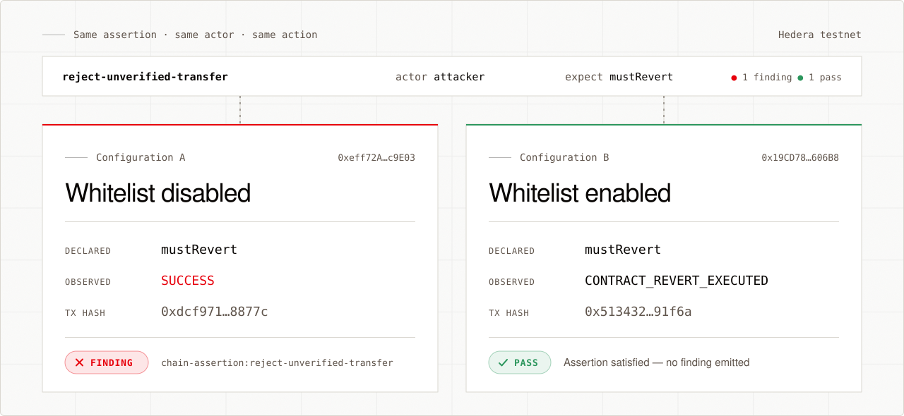
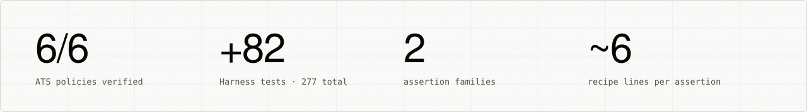

<div align="center">

<a href="https://github.com/akm2006/PolicyProbe">
  <picture>
    <source media="(prefers-color-scheme: dark)" srcset=".github/assets/banner-dark.svg">
    <source media="(prefers-color-scheme: light)" srcset=".github/assets/banner-light.svg">
    
  </picture>
</a>

<h3>Deterministic on-chain behavioral assertions for Hedera Harness</h3>

<p>
  A command that exits <code>0</code> proves the command finished.<br>
  PolicyProbe proves the deployed contract enforced the rule it was built to enforce.
</p>

<p>
  <a href="https://github.com/akm2006/PolicyProbe/actions/workflows/ci.yml"></a>
  <a href="fixtures/ats-bond/EVIDENCE.md"></a>
  <a href="https://github.com/hedera-dev/hedera-harness/pull/74"></a>
  
  <a href="LICENSE"></a>
</p>

<p>
  <a href="#why-policyprobe"><b>Why</b></a>&nbsp;&nbsp;·&nbsp;&nbsp;
  <a href="#one-assertion"><b>Recipe</b></a>&nbsp;&nbsp;·&nbsp;&nbsp;
  <a href="#how-it-works"><b>How it works</b></a>&nbsp;&nbsp;·&nbsp;&nbsp;
  <a href="#testnet-evidence"><b>Evidence</b></a>&nbsp;&nbsp;·&nbsp;&nbsp;
  <a href="#quickstart"><b>Quickstart</b></a>&nbsp;&nbsp;·&nbsp;&nbsp;
  <a href="#documentation"><b>Docs</b></a>
</p>

</div>

<br>

## Why PolicyProbe

[Hedera Harness](https://github.com/hedera-dev/hedera-harness) already checks builds, commands,
browser behavior, and semantic requirements. One failure mode slips through all of them: **the
pipeline is green, but the contract misbehaves.**

Take a tokenized bond that must refuse transfers to unverified investors. Deploy it with the
whitelist switched off, and the deploy succeeds. A forbidden transfer then succeeds too, and
every process exits cleanly. Nothing in the run reports a broken policy.

PolicyProbe lets a recipe state the rule directly: *this action, signed by this account, must
revert.* Harness executes the action on Hedera and reads the consensus result from Mirror Node.
It then compares that result with the declaration in code. The outcome is a pass or a typed
`ValidationFinding`, which enters the existing repair loop. No model decides the verdict.

<picture>
  <source media="(prefers-color-scheme: dark)" srcset=".github/assets/comparison-dark.svg">
  <source media="(prefers-color-scheme: light)" srcset=".github/assets/comparison-light.svg">
  
</picture>

<p align="center"><sub>Two real ATS bonds on Hedera testnet that differ only in whitelist configuration. Both transactions are linked in <a href="fixtures/ats-bond/EVIDENCE.md">EVIDENCE.md</a>.</sub></p>

## One assertion

About six lines in a recipe. The engine owns everything else: command execution, identifier
extraction, Mirror Node polling, comparison, findings, actor lifecycle, and redaction.

```yaml
# .harness/spec.yaml
chainValidation:
  enabled: true
  network: testnet
  actors:
    attacker: { fundingHbar: 5 }
  assertions:
    - id: reject-unverified-transfer
      actor: attacker
      action:
        name: attempt-transfer
        command: npx tsx scripts/transfer.ts
      expect:
        outcome: mustRevert
```

<details>
<summary><b>Assert what a transaction moved, not only whether it landed</b></summary>
<br>

`balanceDelta` composes with `outcome`. Harness samples the holder's balance before the action and
again after confirmation. The assertion passes only on an exact match.

```yaml
assertions:
  - id: coupon-balance-delta
    action:
      name: run-coupon
      command: yarn hardhat run scripts/pay-coupon.ts --network hederaTestnet
    expect:
      outcome: mustSucceed
      balanceDelta:
        accountEnv: ALICE_ACCOUNT_ID
        asset: hbar
        equals: "500000000"
```

</details>

<table>
  <tr>
    <td width="50%" valign="top">
      <h4>Transaction outcomes</h4>
      <code>mustSucceed</code> or <code>mustRevert</code> for one declared action, with optional
      standard Solidity revert-reason matching.
    </td>
    <td width="50%" valign="top">
      <h4>Exact balance deltas</h4>
      Signed changes in HBAR, native HTS tokens, or ERC-20-compatible contract balances.
      Nothing approximate.
    </td>
  </tr>
  <tr>
    <td width="50%" valign="top">
      <h4>Named actors</h4>
      Separately funded, ephemeral signers such as an attacker, an investor, or a compliance
      officer, for exercising real authorization boundaries.
    </td>
    <td width="50%" valign="top">
      <h4>Typed findings</h4>
      Policy mismatches become <code>chain-assertion:&lt;id&gt;</code> and enter the repair loop.
      Network failures become <code>chain-assertion-infra</code> and stay out of it.
    </td>
  </tr>
  <tr>
    <td width="50%" valign="top">
      <h4>Key redaction</h4>
      Primary and actor signer keys are scrubbed from reports and repair prompts.
    </td>
    <td width="50%" valign="top">
      <h4>Backward compatible</h4>
      Recipes without <code>chainValidation.assertions</code> or actors behave exactly as before.
    </td>
  </tr>
</table>

## How it works

<picture>
  <source media="(prefers-color-scheme: dark)" srcset=".github/assets/flow-dark.svg">
  <source media="(prefers-color-scheme: light)" srcset=".github/assets/flow-light.svg">
  
</picture>

The evidence reader accepts both EVM transaction hashes and native Hedera transaction IDs. It can
verify ATS diamond contracts as well as native SDK flows. Execution and trust boundaries are
documented in [ARCHITECTURE.md](docs/ARCHITECTURE.md).

> [!NOTE]
> **Where the code lives.** The engine is on the Harness fork branch
> [`feat/deterministic-onchain-postconditions`](https://github.com/akm2006/hedera-harness/tree/feat/deterministic-onchain-postconditions)
> and is proposed upstream as [hedera-harness#74](https://github.com/hedera-dev/hedera-harness/pull/74).
> This repository holds the reproducible ATS fixture, the recorded testnet evidence, design notes,
> the benchmark, and the documentation site.

## Testnet evidence

Six policies were run against a real bond issued through
[Asset Tokenization Studio](https://github.com/hashgraph/asset-tokenization-studio) on Hedera
testnet. They cover the whitelist, role, freeze, and pause controls. Every result was re-read from
Mirror Node, and every row links to its transaction on HashScan.

| | Policy | Expected | Observed on Mirror Node | Transaction |
|:-:|---|:-:|---|---|
| ✓ | **`reject-unverified-transfer`**<br><sub>An unverified investor must not receive the bond</sub> | revert | `CONTRACT_REVERT_EXECUTED` | [`0x513432…91f6a`](https://hashscan.io/testnet/transaction/0x513432955ca52f21edfb0c929d1cd6b91b1425b2aad28cd8e0830bb364391f6a) |
| ✓ | **`verified-transfer-succeeds`**<br><sub>A verified investor can receive the bond</sub> | success | `SUCCESS` | [`0xaf9d20…d4e7e`](https://hashscan.io/testnet/transaction/0xaf9d207c5caf18ba1fbd789cf851567a43149b8ee9540d953c9a5250986d4e7e) |
| ✓ | **`attacker-cannot-freeze`**<br><sub>An account without the freeze role must not freeze a holder</sub> | revert | `CONTRACT_REVERT_EXECUTED` | [`0xc8ade9…6bc7`](https://hashscan.io/testnet/transaction/0xc8ade9fb73e8ed65119fe7e699047ec645da54087551594e189a4bb1a9316bc7) |
| ✓ | **`frozen-holder-cannot-transfer`**<br><sub>A frozen holder must not be able to transfer</sub> | revert | `CONTRACT_REVERT_EXECUTED` | [`0x411665…2a31`](https://hashscan.io/testnet/transaction/0x41166503c2f8a5665d14538b5f3aa0ccdb6e08087e0fd5ecc3e8583205752a31) |
| ✓ | **`compliance-can-pause`**<br><sub>The compliance role may pause the whole asset</sub> | success | `SUCCESS` | [`0x555bd0…4cd1`](https://hashscan.io/testnet/transaction/0x555bd0e8f4fa7c338f552ad2213a333f6162510efebb35d8dd2964c4b9544cd1) |
| ✓ | **`paused-asset-blocks-transfer`**<br><sub>While paused, no transfer may succeed, even between verified investors</sub> | revert | `CONTRACT_REVERT_EXECUTED` | [`0xaa0264…f737`](https://hashscan.io/testnet/transaction/0xaa02643a27c9b1b30a608d3b78838b8aef5e4fa1b7dda4a67b23bd0d7ccaf737) |

Contract addresses, actor accounts, and the before/after hashes are in
[EVIDENCE.md](fixtures/ats-bond/EVIDENCE.md). No private keys are included.

> [!IMPORTANT]
> PolicyProbe verifies technical behavior on Hedera testnet. It does not certify legal or
> regulatory compliance.

## By the numbers

<picture>
  <source media="(prefers-color-scheme: dark)" srcset=".github/assets/stats-dark.svg">
  <source media="(prefers-color-scheme: light)" srcset=".github/assets/stats-light.svg">
  
</picture>

Measured against `hedera-dev/hedera-harness:dev` at `587a2f3`. The patch adds 1,174 lines of
production and prompt code and 1,599 lines of tests across seven test files. Methodology, local
results, and known limitations are in [BENCHMARK.md](docs/BENCHMARK.md).

## Quickstart

**Requirements:** Node.js 20 or newer, and Linux or macOS for the canonical Harness `npm test`.
Building and testing need no credentials.

```bash
# 1. Clone side by side. The fixture imports ../../../hedera-harness/dist
git clone -b feat/deterministic-onchain-postconditions https://github.com/akm2006/hedera-harness.git
git clone https://github.com/akm2006/PolicyProbe.git

# 2. Build and test the engine (277 tests)
cd hedera-harness
npm ci && npm run typecheck && npm test && npm run build

# 3. Build the ATS bond fixture
cd ../PolicyProbe/fixtures/ats-bond
npm ci && npm run build
```

<details>
<summary><b>Run the six policies live on Hedera testnet</b></summary>
<br>

Requires a funded **ECDSA** testnet account from [portal.hedera.com](https://portal.hedera.com).
ED25519 accounts have no EVM alias and cannot be used.

```bash
export HEDERA_OPERATOR_ID=0.0.1234567
export HEDERA_OPERATOR_KEY=0x...          # ECDSA private key

# One time: create and fund Alice, Bob, Carol, and an attacker (keys go to the ignored .actors.json)
npx tsx src/setup-actors.ts

# Issue a whitelist-enabled bond through the ATS factory. It prints: diamond 0x...
npx tsx src/01-deploy-bond.ts

# Grant roles, whitelist investors, issue units, and freeze Carol
BOND_DIAMOND_ADDRESS=0x... npx tsx 02-setup-policy-fixtures.ts

# Point the BOND constant in run-policy-suite.mjs at your diamond, then run the suite
node run-policy-suite.mjs                 # 6 / 6 PASS
```

</details>

> [!CAUTION]
> Never commit or paste operator or actor private keys. The scripts read credentials from the
> environment, and live runs spend testnet HBAR.

## Repository

```text
PolicyProbe
├── fixtures/ats-bond   ATS bond fixture: six policies, before/after demo, recorded evidence
├── docs                architecture, benchmark, decisions, related work, upstream PR text
├── web                 Next.js site and Fumadocs documentation portal
└── .github             CI workflow and README artwork
```

## Documentation

| Guide | What's inside |
|---|---|
| [Architecture](docs/ARCHITECTURE.md) | Execution flow and trust boundaries |
| [Benchmark](docs/BENCHMARK.md) | Diff size, test counts, local verification, and limitations |
| [Design decisions](docs/DECISIONS.md) | Why the engine is shaped the way it is |
| [Related upstream work](docs/RELATED_WORK.md) | How this fits alongside other Harness pull requests |
| [Testnet evidence](fixtures/ats-bond/EVIDENCE.md) | Contracts, actors, and every transaction hash |
| [ATS bond fixture](fixtures/ats-bond/README.md) | Files, setup, and how the suite calls the engine |
| [Upstream PR description](docs/UPSTREAM_PR_DESCRIPTION.md) | The proposal as submitted to hedera-harness |
| [ETHOnline 2026](docs/ETHONLINE_2026.md) | Submission notes |
| [AI usage disclosure](docs/AI_USAGE.md) | How AI tools were used in this project |

The full documentation site lives in [`web/`](web). Run `npm install && npm run dev` there and open
`http://localhost:3000/docs`.

## Contributing

The implementation and recorded testnet evidence are complete, and the upstream proposal is in
review. Contributions should keep the Harness patch generic, dependency-light, and backward
compatible, with focused `node:test` coverage. Keep application-policy findings separate from
infrastructure failures, and never commit keys, actor files, or run artifacts.

To report a vulnerability, follow [SECURITY.md](SECURITY.md).

## License

Released under the [Apache-2.0 License](LICENSE). Portions of the ATS deployment flow are adapted
from Asset Tokenization Studio. See [NOTICE](NOTICE).

<br>

<div align="center">
  <picture>
    <source media="(prefers-color-scheme: dark)" srcset=".github/assets/mark-dark.svg">
    <source media="(prefers-color-scheme: light)" srcset=".github/assets/mark-light.svg">
    
  </picture>
  <br>
  <sub><b>PolicyProbe</b>&nbsp;&nbsp;·&nbsp;&nbsp;Expected. Executed. Verified.</sub>
  <br>
  <sub>Hedera, Hashgraph, and related names may be trademarks of their respective owners.</sub>
</div>
