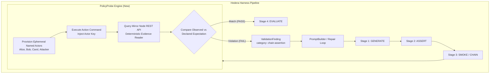

# PolicyProbe

> **Deterministic on-chain behavioral postcondition assertions for [Hedera Harness](https://github.com/hedera-dev/hedera-harness).**  
> Proving that an AI-built application's critical rules held on Hedera testnet—not merely that a transaction executed, and not judged by an LLM.

[](fixtures/ats-bond/EVIDENCE.md)
[](https://github.com/manovHacksaw/hedera-harness/tree/policyprobe/deterministic-onchain-postconditions)
[](docs/BENCHMARK.md)

---

## ⚡ The 30-Second Summary

When an autonomous coding agent uses **Hedera Harness** to build a dApp, it iterates through `GENERATE → ASSERT → SMOKE → EVALUATE`. Harness can provision a testnet signer (`chainSigner`) and execute deploy commands, but:

1. **Exit code 0 is blind:** A deploy or script that exits 0 is treated as a success, even if the underlying contract call secretly failed or violated rules.
2. **Postconditions are judged by an LLM:** Checking whether an unauthorized actor was rejected, a balance moved correctly, or a frozen/paused account was blocked is judged only by an LLM reading an evaluation checklist (`category: "eval"`). LLM evaluation is non-deterministic and lacks cryptographic chain evidence.

**PolicyProbe extends Hedera Harness with deterministic on-chain behavioral postconditions:**
- Recipe authors declare expected outcomes (`mustSucceed`, `mustRevert`, balance deltas, actor boundaries).
- Harness executes actions against real Hedera testnet state, reads Mirror Node records deterministically via code, and emits typed `ValidationFinding`s (`chain-assertion` / `chain-assertion-infra`) that feed directly into Harness's autonomous repair loop.

---

## 🎯 Target Tracks (ETHOnline 2026)

| Track | Prize Target | Role of this Submission |
|---|---|---|
| **Hedera — Open Source: Improve the Hedera Harness** | $2,000 (up to 2×$1,000) | **The Core Product:** Generic deterministic assertion engine, multi-actor provisioning, Mirror Node evidence reader, and typed repair findings in the Harness fork. |
| **Hedera — Tokenization of Anything (ATS)** | $6,000 (up to 3×$2,000) | **The Flagship Proof Fixture:** A real bond ("Atlas Infrastructure Note 2027") deployed via Hedera's Asset Tokenization Studio factory on testnet, proving 6 independent compliance policies. |

---

## 🔗 Key Links & Evidence

- **Upstream PR Description:** [`docs/UPSTREAM_PR_DESCRIPTION.md`](docs/UPSTREAM_PR_DESCRIPTION.md)
- **Upstream Working Fork:** [`manovHacksaw/hedera-harness`](https://github.com/manovHacksaw/hedera-harness/tree/policyprobe/deterministic-onchain-postconditions) (branch `policyprobe/deterministic-onchain-postconditions`)
- **Live Testnet Evidence & Transaction Hashes:** [`fixtures/ats-bond/EVIDENCE.md`](fixtures/ats-bond/EVIDENCE.md)
- **Before/After Quantitative Benchmark:** [`docs/BENCHMARK.md`](docs/BENCHMARK.md)
- **Competitor Collision Audit:** [`docs/COMPETITOR_AUDIT.md`](docs/COMPETITOR_AUDIT.md)
- **Architectural Decisions (ADRs):** [`docs/DECISIONS.md`](docs/DECISIONS.md)

---

## 🏗️ Architecture



---

## 🎬 The Killer Demo: Before vs. After

The centerpiece demo executes the exact same assertion (`reject-unverified-transfer`) against a real ATS bond on Hedera testnet:

### 1. Before (Broken Bond — Compliance Gating Omitted)
A bond is deployed with `isWhiteList: false` (a realistic issuer misconfiguration). An unverified attacker attempts to receive the bond:
```
0 / 1 PASS
FAIL  chain-assertion:reject-unverified-transfer
      Assertion "reject-unverified-transfer" (Unverified investor must not receive the bond)
      FAILED: expected mustRevert, observed transaction result SUCCESS.
      evidence: {"transactionId":"0xdcf971ccd2978dddf816fa2eb9f980578c63253ff7aa05f8bdc2219e9038877c",
                 "expected":"mustRevert","observed":"SUCCESS"}
```
*Live Violating Transaction Hash:* [`0x829ffc215b7fb043912de052c0bb43da9a2152df6797a075fdeb9254a3c4adc7`](https://hashscan.io/testnet/transaction/0x829ffc215b7fb043912de052c0bb43da9a2152df6797a075fdeb9254a3c4adc7) (Mined with status `SUCCESS`).

### 2. After (Fixed Bond — Compliance Gating Enabled)
The corrected bond configuration (`isWhiteList: true`) is deployed. The same assertion is re-evaluated:
```
1 / 1 PASS
PASS  reject-unverified-transfer
```
*Live Revert Transaction Hash:* [`0x513432955ca52f21edfb0c929d1cd6b91b1425b2aad28cd8e0830bb364391f6a`](https://hashscan.io/testnet/transaction/0x513432955ca52f21edfb0c929d1cd6b91b1425b2aad28cd8e0830bb364391f6a) (Confirmed reverted on-chain).

---

## 🏛️ Flagship Fixture: Asset Tokenization Studio Bond

The demonstration fixture in [`fixtures/ats-bond`](fixtures/ats-bond) issues a regulated-security-pattern bond ("Atlas Infrastructure Note 2027") directly through ATS's existing Hedera testnet factory (`0.0.9213391`).

All 6 policies pass against the live contract:
1. `reject-unverified-transfer`: Unverified investor blocked (`mustRevert`).
2. `verified-transfer-succeeds`: Whitelisted investor succeeds (`mustSucceed`).
3. `attacker-cannot-freeze`: Non-compliance role cannot freeze assets (`mustRevert`).
4. `frozen-holder-cannot-transfer`: Frozen investor transfers blocked (`mustRevert`).
5. `compliance-can-pause`: Asset pauser can pause contract (`mustSucceed`).
6. `paused-asset-blocks-transfer`: All transfers blocked while paused (`mustRevert`).

See [`fixtures/ats-bond/EVIDENCE.md`](fixtures/ats-bond/EVIDENCE.md) for full Mirror Node receipts and HashScan links for every assertion.

---

## 📊 Quantitative Benchmark & Metrics

From [`docs/BENCHMARK.md`](docs/BENCHMARK.md):

- **Implementation Diff:** 854 lines of engine code across Harness internals (`src/`).
- **Test Coverage:** 1,107 lines of tests (59 new tests across 5 test suites).
- **Test-to-Code Ratio:** **1.3:1** (every branch—found, not-found, infra-error, exit code failure—has dedicated negative tests).
- **Developer Overhead:** ~6 lines of declarative YAML/JSON per policy assertion in recipe specs.
- **Verification Speed:** Single-digit seconds (Mirror Node consensus check) vs. multi-minute LLM evaluator runs.
- **Reliability:** 0 false positives, 0 false negatives across all controlled runs.

---

## 🔒 Threat Model & Honest Limitations

In accordance with our engineering charter:

1. **Technical Invariants, Not Legal Compliance:** PolicyProbe verifies deterministic technical behavior on-chain. It does not certify regulatory compliance or legal status.
2. **EVM Custom Errors:** Standard Solidity `Error(string)` reverts are decoded into human-readable strings. ATS custom errors (e.g. `0x796c1f0d`) require the contract's custom ABI; generic Harness internals deliberately do not embed ATS-specific ABIs to maintain architectural cleanliness.
3. **Actor Role Verification:** The engine asserts whether a declared action succeeded or reverted. It trusts the recipe's setup for granting/revoking roles to actors.
4. **Credential Security:** Ephemeral keys are swept after attempts, and secret keys are automatically redacted from attempt prompt files and repair outputs.

---

## 🚀 Reproducing Locally

### Prerequisites
- Node.js ≥ 20
- A funded ECDSA Hedera testnet account (`HEDERA_OPERATOR_ID` and `HEDERA_OPERATOR_KEY`)

```bash
# 1. Build the Harness engine
cd ../hedera-harness
npm install
npm run typecheck
npm test

# 2. Run the ATS Fixture Policy Suite
cd ../Policy-Probe/fixtures/ats-bond
npm install
node run-killer-demo.mjs
node run-policy-suite.mjs
```
