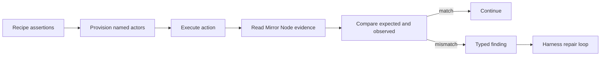

# PolicyProbe

PolicyProbe adds deterministic on-chain behavioral assertions to
[Hedera Harness](https://github.com/hedera-dev/hedera-harness). A recipe can execute an action
as a named signer, require that it succeeds or reverts, and verify an exact HBAR or token
balance delta from Mirror Node evidence.

Harness already checks builds, commands, browser behavior, and semantic requirements.
PolicyProbe covers a different failure mode: a command can exit successfully while the
resulting contract behavior violates the intended policy. Assertion failures become typed
`ValidationFinding` values and enter the existing repair loop.

```yaml
chainValidation:
  enabled: true
  network: testnet
  actors:
    attacker: { fundingHbar: 5 }
  assertions:
    - id: reject-unverified-transfer
      actor: attacker
      action:
        name: attempt-transfer
        command: npx tsx scripts/transfer.ts
      expect:
        outcome: mustRevert
```

## What it verifies

- `mustSucceed` and `mustRevert` transaction outcomes
- Optional standard Solidity revert-reason matching
- Exact signed HBAR, native HTS, and ERC-20-compatible balance deltas
- Authorization boundaries across separately funded ephemeral actors
- Infrastructure failures as `chain-assertion-infra`, separate from application-policy failures
- Redaction of primary and actor signer keys from reports and repair prompts

## Evidence

The included [ATS bond fixture](fixtures/ats-bond) exercises six policies against a real bond
issued through Asset Tokenization Studio on Hedera testnet. The recorded run covers whitelist,
role, freeze, and pause behavior. Transaction hashes and observed outcomes are in
[EVIDENCE.md](fixtures/ats-bond/EVIDENCE.md).

One controlled comparison uses the same `reject-unverified-transfer` assertion against two
configurations:

| Configuration | Declared policy | Observed result | Verdict |
|---|---|---|---|
| Whitelist disabled | transfer must revert | `SUCCESS` | failure |
| Whitelist enabled | transfer must revert | `CONTRACT_REVERT_EXECUTED` | pass |

This is technical behavior verification. It does not certify legal or regulatory compliance.

## Architecture



The implementation lives on the sibling Harness fork branch
`feat/deterministic-onchain-postconditions`. This repository contains the reproducible
ATS fixture, evidence, architecture notes, benchmark, and prepared upstream PR description.
See [ARCHITECTURE.md](docs/ARCHITECTURE.md) for the execution and trust boundaries.

## Reproduce locally

Requirements: Node.js 20 or newer, sibling clones named `Policy-Probe` and `hedera-harness`,
and a funded ECDSA Hedera testnet account for live runs.

```bash
cd ../hedera-harness
npm ci
npm run typecheck
npm test

cd ../Policy-Probe/fixtures/ats-bond
npm ci
npm run build
```

Copy testnet credentials into your shell as `HEDERA_OPERATOR_ID` and
`HEDERA_OPERATOR_KEY`; never commit them. Then follow the one-time deployment and actor setup
steps in the [fixture README](fixtures/ats-bond/README.md). Live runs spend testnet HBAR.

## Project status

The implementation and recorded testnet evidence are complete. The upstream proposal is awaiting
review. Known limitations and measured results are documented in
[BENCHMARK.md](docs/BENCHMARK.md).

## Documentation

- [Architecture and trust boundaries](docs/ARCHITECTURE.md)
- [Measured benchmark](docs/BENCHMARK.md)
- [Design decisions](docs/DECISIONS.md)
- [Related upstream work](docs/RELATED_WORK.md)
- [AI usage disclosure](docs/AI_USAGE.md)
- [ETHOnline submission notes](docs/ETHONLINE_2026.md)
- [Prepared upstream PR description](docs/UPSTREAM_PR_DESCRIPTION.md)

Contributions should keep the Harness patch generic, dependency-light, backward compatible,
and covered by focused `node:test` cases.

## License

Apache-2.0. See [LICENSE](LICENSE) and [NOTICE](NOTICE).
